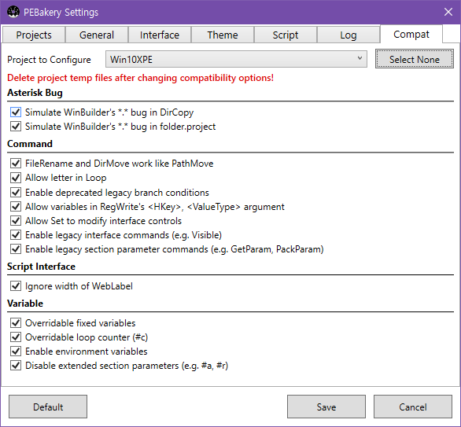

# Compatibility Options

You must set appropriate compatibility options to build projects designed with WinBuilder 082.



## Why it is necessary

Compatibility options are mostly comprised of emulating WinBuilder bugs and quirks.

PEBakery tries hard to keep backward compatibility with WinBuilder 082. But to fix bugs and improve syntax, sometimes breaking changes cannot be avoided. So at the cost of disabling the latest feature and bugfix, PEBakery provides compatibility options to make it behave exactly like WinBuilder as possible.  

## Which to set

By default, PEBakery turns off all compatibility options. Under this circumstances all of them must be turned on.

- A project was designed and tested only with WinBuilder.
- A project was started in pre-PEBakery era (~2017).
- A project is distributed with WinBuilder executable.

As in Feb 2019, most of the existing projects falls into this category.  
This is a list of known projects require turning on compatibility options:

- [ChrisPE](https://github.com/pebakery/chrispe)
- [MistyPE](http://mistyprojects.co.uk/documents/MistyPE/index.html)
- [Win10PESE](http://win10se.cwcodes.net/Compressed/index.php)
- [Win10XPE](http://win10se.cwcodes.net/Compressed/index.php)

## How to set

### The easiest way - Auto Detecter

Compatibility option detector is work-in-progress.

### The easy way - Settings Dialog

1. Open `Settings`, and select `Compat` tab.
1. Make sure proper project is selected.
1. Click `Select All` button.  
1. Save the changes.
1. **IMPORTANT**: Delete project temp files.

### The hard way - PEBakeryCompat.ini

PEBakery manages compatibility options per project, in the file `Projects\<ProjectName>\PEBakeryCompat.ini`. It must be placed alongside `script.project`.

If you have multiple project under single `Projects` directory, you must place `PEBakeryCompat.ini` per each project directory.

Create `PEBakeryCompat.ini` in correct path, and copy and paste these lines:

```ini
[PEBakeryCompat]
AsteriskBugDirCopy=True
AsteriskBugDirLink=True
FileRenameCanMoveDir=True
AllowLetterInLoop=True
LegacyBranchCondition=True
LegacyRegWrite=True
AllowSetModifyInterface=True
LegacyInterfaceCommand=True
LegacySectionParamCommand=True
IgnoreWidthOfWebLabel=True
OverridableFixedVariables=True
OverridableLoopCounter=True
EnableEnvironmentVariables=True
DisableExtendedSectionParams=True
```

| Project | `PEBakeryCompat.ini` Path |
|---|---|
| ChrisPE | `Projects\ChrisPE\PEBakeryCompat.ini` |
| MistyPE | `Projects\MistyPE\PEBakeryCompat.ini` |
| Win10PESE | `Projects\Win10PESE\PEBakeryCompat.ini` |
| Win10XPE | `Projects\Win10XPE\PEBakeryCompat.ini` |
