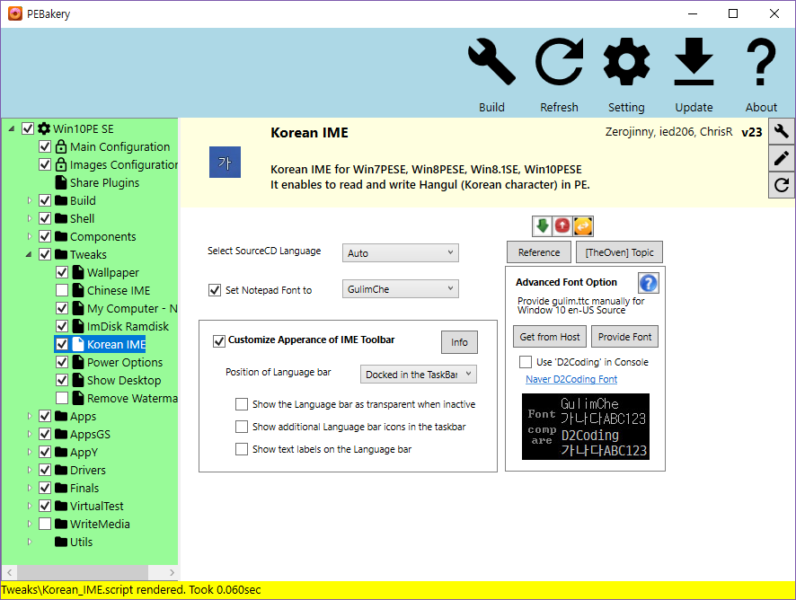

# PEBakery

    

PEBakery is a builder specialized in customizing Windows Preinstalled Envrionment.

| Branch    | Build Status   |
|-----------|----------------|
| Master    |  |
| Develop   |  |

PEBakery is compatible with WinBuilder 082.

## Disclaimer

- All implementation is only backed by documentation and blackbox testing, without violating WinBuilder 082's EULA.
- Even though I did not experienced data corruption while developing, it is highly recommended to backup your files.
- I do not provide any warranty, use at your own risk.

## License

PEBakery is mianly licensed under GPLv3 or any later version with additional permission.

Some parts of PEBakery is licensed under MIT License and others.

## Build

To compile PEBakery from source, Visual Studio and .Net Framework is required.

### Recommended

- Visual Studio 2017 Community

### Requirement

- C# 7 Compiler
- .Net Framework 4.7.1 Developer Pack

## Documentation

See [PEBakery Manual](https://github.com/pebakery/pebakery-docs).

## Screenshots

### PEBakery Beta 3

