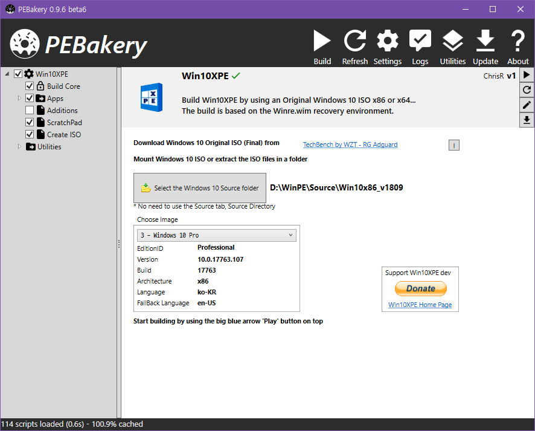

# PEBakery

    

PEBakery is a builder specialized in customizing Windows Preinstalled Environment.

| Branch    | Build Status   |
|-----------|----------------|
| Master    |  |
| Develop   |  |

PEBakery is backward compatible with WinBuilder 082 and improves upon it.

## Disclaimer

- All implementation is only backed by documentation and black box testing, without violating WinBuilder 082's EULA.
- I do not provide any warranty, use at your own risk. Backup is highly recommended.
- Windows Preinstalled Environment is a registered trademark of Microsoft.

## Download

The official release version is recommended for normal use.

A nightly build is provided for the testing purpose.

- [Official Release](https://github.com/pebakery/pebakery/releases)
- [Lastest Nightly (develop)](https://ci.appveyor.com/api/projects/ied206/PEBakery/artifacts/nightly.zip?branch=develop)

**CAUTION**: Do not forget to set [proper compatibility options](./COMPAT.md) per projects.

## Prerequisite

If you are using Windows 10 v1803 or later, no action is necessary.  
If not, please install [.Net Framework 4.7.2](http://go.microsoft.com/fwlink/?LinkId=863262).

## License

PEBakery is mainly licensed under GPLv3 or any later version with additional permission.

Some parts of PEBakery is licensed under the MIT License and others.

Please read [LICENSE](./LICENSE) for details.

## Build

To compile PEBakery from source, Visual Studio and .Net Framework is required.

### Requirement

- [Visual Studio 2017 15.7](https://visualstudio.microsoft.com/ko/thank-you-downloading-visual-studio/?sku=Community&rel=15#) or higher.
   
- [.Net Framework 4.7.2 Developer Pack](https://go.microsoft.com/fwlink/?linkid=874338) or higher for C# projects.
- [.Net Core 2.1 SDK](https://dotnet.microsoft.com/download) or higher for C# libraries.
- [Windows 8.1 SDK](https://go.microsoft.com/fwlink/p/?LinkId=323507) for compiling [LauncherNative](./LauncherNative).
  - [LauncherNative](./LauncherNative) can be compiled with virtually any supported version of Windows SDK.
  - If you do not want to install Windows SDK, use [LauncherSharp](./LauncherSharp) instead.

## Documentation

Please read [PEBakery Manual](https://github.com/pebakery/pebakery-docs).

## Progress and TODO

See [here](https://github.com/pebakery/pebakery/projects/2).

## Screenshots

### PEBakery Nightly (20190404)

### PEBakery Beta 5

