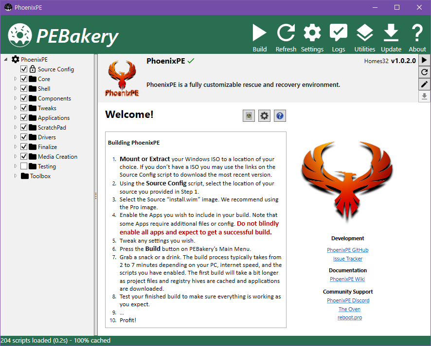
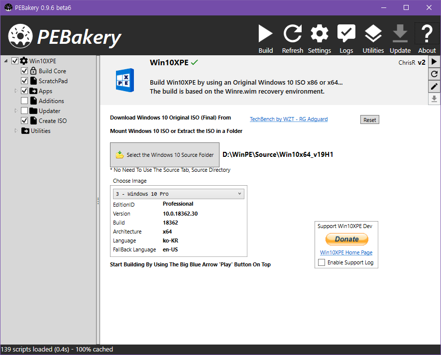

# PEBakery

<div style="text-align: left">
    
</div>

PEBakery is a script engine that specializes in customizing the Windows Preinstalled Environment (WinPE/WinRE).

| CI Server       | Branch  | Build Status   |
|-----------------|---------|----------------|
| AppVeyor        | Master  | [](https://ci.appveyor.com/project/ied206/pebakery/branch/master) |
| AppVeyor        | Develop | [](https://ci.appveyor.com/project/ied206/pebakery/branch/develop) |
| Azure Pipelines | Master  | [](https://dev.azure.com/ied206/pebakery/_build/latest?definitionId=5&branchName=master) |
| Azure Pipelines | Develop | [](https://dev.azure.com/ied206/pebakery/_build/latest?definitionId=5&branchName=develop) |

PEBakery is backward compatible with WinBuilder 082 and makes significant improvements upon it.

## Disclaimer

- All implementation is backed by documentation and black box testing, without violating the EULA of WinBuilder 082.
- The developers do not provide any warranty, use it at your own risk. Backup is highly recommended.
- Windows Preinstalled Environment is a registered trademark of Microsoft.

## Download

The official release version is recommended for general use.

A nightly build is provided for testing purposes. 

- [Official Release](https://github.com/pebakery/pebakery/releases)
- [Lastest Nightly (develop)](https://ci.appveyor.com/project/ied206/pebakery/build/artifacts?branch=develop)
    - [Standalone Nightly (x64)](https://ci.appveyor.com/api/projects/ied206/PEBakery/artifacts/Publish/PEBakery-nightly-sc_x64.7z?branch=develop)
      - No dependency
      - Sizes about 170MB
    - [Standalone Nightly (arm64)](https://ci.appveyor.com/api/projects/ied206/PEBakery/artifacts/Publish/PEBakery-nightly-sc_arm64.7z?branch=develop)
      - No dependency
      - Sizes about 180MB
    - **[Runtime-dependent Nightly (x64, x86, arm64)](https://ci.appveyor.com/api/projects/ied206/PEBakery/artifacts/Publish/PEBakery-nightly-rt.7z?branch=develop)**
      - Requires [.NET 6 Desktop Runtime](https://dotnet.microsoft.com/en-us/download/dotnet/6.0/runtime)
      - Sizes about 28MB
      - Supports both x64, x86, arm64 architecture

**CAUTION**: Do not forget to set the proper compatibility options for your projects. We have prepared a special [Migrating from WinBuilder](https://github.com/pebakery/pebakery-docs/blob/master/CodingGuide/Migrating.md) guide, so you know what script breaking changes to expect and when compatibility options need to be enabled.

Nightly binaries are served by AppVeyor artifacts. 

## Prerequisites

PEBakery runs on .NET 6. 

- *Standalone Nightly* does not require any runtime installed, but runs only on one architecture (e.g. **x64**).
- *Runtime Dependent Nightly* runs on both **x64**, **x86** and **arm64** Windows, but requires latest **[.NET 6 Desktop Runtime](https://dotnet.microsoft.com/en-us/download/dotnet/6.0/runtime)** to be installed.

## License

PEBakery is primarily licensed under GPLv3 or any later version with additional permission.

Some parts of PEBakery are licensed under the MIT License and other licenses.

Please read [LICENSE](./LICENSE) for details.

## ChangeLog

Please read [ChangeLog](./CHANGELOG.md).

## Documentation

Please read the [Official PEBakery Manual](https://github.com/pebakery/pebakery-docs).

Testers using nightly builds should refer to the developer branch [Official PEBakery Manual (develop)](https://github.com/pebakery/pebakery-docs/tree/develop).

## Build Instructions

.NET Core SDK, Windows SDK, and MSVC are required to compile PEBakery from the source.

### Requirement

- [.NET 6 SDK](https://dotnet.microsoft.com/en-us/download/dotnet/6.0) to build and test `PEBakery.exe`.
- [Windows 10 SDK](https://developer.microsoft.com/ko-kr/windows/downloads/windows-10-sdk) to build `PEBakeryLauncher.exe`
    - Requires [Microsoft C++ Build Tools 2022](https://visualstudio.microsoft.com/visual-cpp-build-tools/) or later

If you are a contributor, we recommend using a full-featured Visual Studio Community for the best development experience.

- [Visual Studio 2022](https://visualstudio.microsoft.com/vs/)

### Compiling

Nightly binaries can be compiled by running `.\BinaryPublish.ps1 -nightly` on PowerShell.

- `Publish\PEBakery-nightly-rt` : Runtime-dependent binary
- `Publish\PEBakery-nightly-sc_{arch}` : Standalone binary for a specific architecture

### Testing

To test PEBakery, download one of the PE projects and install the PEBakery binary.

#### Known PE Projects 

These PE projects officially support PEBakery.

- [PhoenixPE](https://github.com/PhoenixPE/PhoenixPE)
- [ChrisPE](https://github.com/pebakery/chrispe)

These PE projects have been tested with PEBakery.

- [Win10XPE](https://github.com/ChrisRfr/Win10XPE)

#### Installation

**NOTE**: `<ProjectPath>` is the directory that contains the `Projects` directory from the PE building project.

1. (Simple) Copy `PEBakeryLauncher.exe` and `Binary` inside `<ProjectPath>`, and run `PEBakeryLauncher.exe`.
2. (Advanced) Launch `PEBakeryLauncher.exe` or `PEBakery.exe` with `--baseDir` parameter.
    ```cmd
    $ .\PEBakeryLauncher.exe --baseDir <ProjectPath>
    # or
    $ .\Binary\PEBakery.exe --baseDir <ProjectPath>
    ```

## Screenshots

### PEBakery v1.0.0




