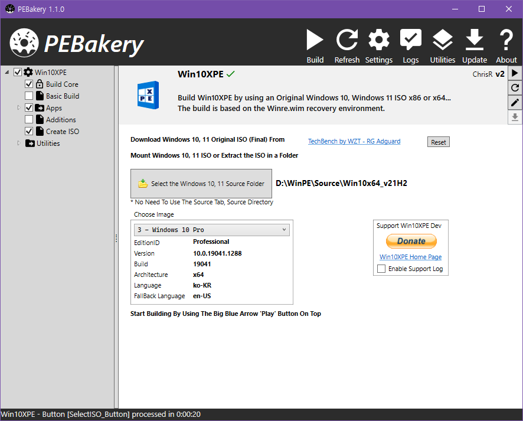

# PEBakery

    

PEBakery is a script engine that specializes in customizing the Windows Preinstalled Environment (WinPE/WinRE).

| Branch    | Build Status   |
|-----------|----------------|
| Master    |  |
| Develop   |  |

PEBakery is backward compatible with WinBuilder 082 and makes significant improvements upon it.

## Disclaimer

- All implementation is only backed by documentation and black box testing, without violating WinBuilder 082's EULA.
- The developers do not provide any warranty, use at your own risk. Backup is highly recommended.
- Windows Preinstalled Environment is a registered trademark of Microsoft.

## Download

The official release version is recommended for general use.

A nightly build is provided for testing purposes.

- [Official Release](https://github.com/pebakery/pebakery/releases)
- [Lastest Nightly (develop)](https://ci.appveyor.com/api/projects/ied206/PEBakery/artifacts/nightly.zip?branch=develop)

**CAUTION**: Do not forget to set the proper compatibility options for your projects. We have prepared a special [Migrating from Winbuilder](https://github.com/pebakery/pebakery-docs/blob/master/CodingGuide/Migrating.md) guide, so you know what script breaking changes to expect and when compatibility options need to be enabled.

## Prerequisites

If you are using Windows 10 v1803 or later, no action is necessary.  
If not, please install [.Net Framework 4.7.2](http://go.microsoft.com/fwlink/?LinkId=863262).

## License

PEBakery is primarily licensed under GPLv3 or any later version with additional permission.

Some parts of PEBakery are licensed under the MIT License and other licenses.

Please read [LICENSE](./LICENSE) for details.

## Build

Visual Studio, .Net Framework, and .Net Core are required to compile PEBakery from the source.

### Requirement

- [Visual Studio 2019 16.3](https://visualstudio.microsoft.com/en/thank-you-downloading-visual-studio/?sku=community&rel=16) or higher.
- [.Net Framework 4.7.2 Developer Pack](https://go.microsoft.com/fwlink/?linkid=874338) for C# application projects.
- [.Net Core 2.1 SDK](https://dotnet.microsoft.com/download) or higher for C# libraries.
- [Windows 10 SDK (10.0.18362.0)](https://developer.microsoft.com/ko-kr/windows/downloads/windows-10-sdk) for compiling [LauncherNative](./LauncherNative).
  - [LauncherNative](./LauncherNative) can be compiled with virtually any supported version of Windows SDK.
  - If you do not want to install Windows SDK, use [LauncherSharp](./LauncherSharp) instead.

## Documentation

Please read the [Official PEBakery Manual](https://github.com/pebakery/pebakery-docs).

Testers using nightly builds should refer to the developer branch [Official PEBakery Manual (develop)](https://github.com/pebakery/pebakery-docs/tree/develop).

## Progress and TODO

See our [Roadmap](https://github.com/pebakery/pebakery/projects/2).

## Screenshots

### PEBakery Beta 6

